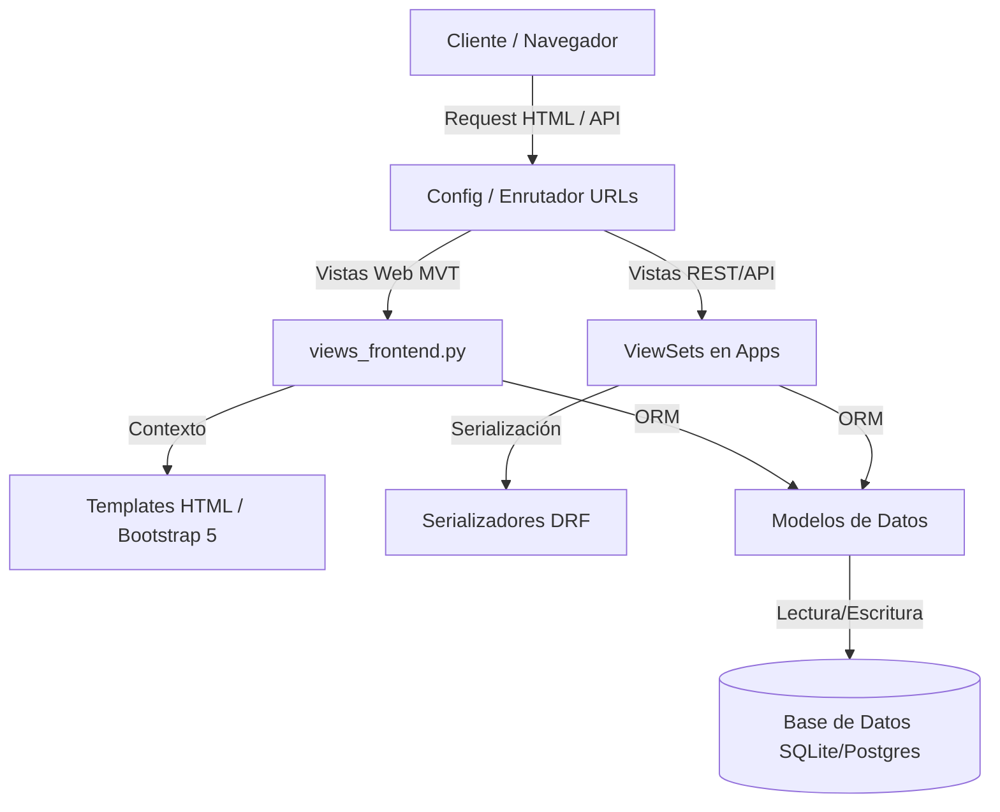
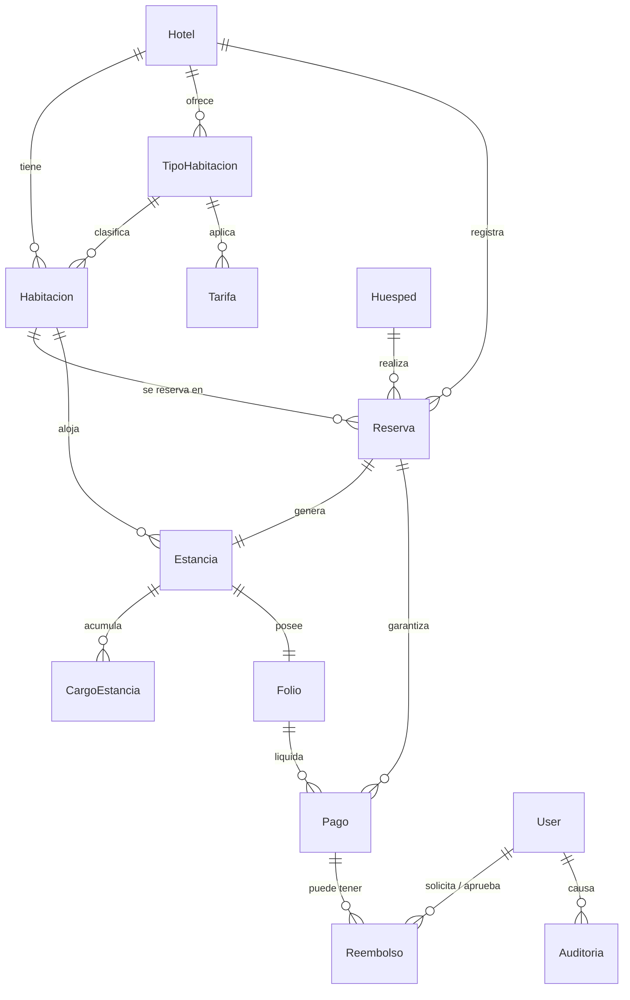

# AI PROJECT CONTEXT

## Descripción General

El **Hotel System** es un sistema integral de gestión hotelera (PMS - Property Management System) diseñado para automatizar y optimizar las operaciones diarias de un hotel. Permite gestionar habitaciones, reservas, huéspedes, estancias, folios de consumo, facturación, limpieza (housekeeping) y reportes analíticos en tiempo real. 

### Objetivos Principales
*   **Gestión del Ciclo del Huésped:** Automatizar desde la reserva inicial hasta el Check-In, consumos durante la estancia, pagos y el Check-Out.
*   **Control del Inventario Física:** Monitorear en tiempo real el estado de las habitaciones (Disponible, Ocupada, Limpieza, Mantenimiento).
*   **Transparencia Financiera:** Administrar folios de cargos con desglose de IGV y control de pagos y reembolsos.
*   **Toma de Decisiones:** Suministrar métricas clave de ocupación y rendimiento (RevPAR, ADR) mediante reportes visuales y exportables.

### Problemas que Resuelve
*   Evita la sobreventa (double-booking) controlando solapamientos de fechas y horas en tiempo real.
*   Controla pérdidas financieras impidiendo salidas sin folios liquidados o sobrepagos.
*   Agiliza el trabajo del personal mediante interfaces personalizadas según el rol (Recepcionista, Administrador, Limpieza).

---

## Stack Tecnológico

*   **Lenguaje:** Python 3.11+
*   **Framework Backend:** Django 6.0
*   **API Framework:** Django REST Framework (DRF) 3.17
*   **Autenticación:** SimpleJWT (JSON Web Tokens) con expiración de 8 horas para tokens de acceso y 24 horas para tokens de refresco.
*   **Base de datos:** 
    *   **Desarrollo:** SQLite 3
    *   **Producción:** PostgreSQL 15+ (configurado mediante variables de entorno)
*   **Frontend:** Bootstrap 5.3, Bootstrap Icons, Chart.js, HTML5 semántico
*   **CSS / JavaScript:** Tailwind y ad-hoc omitidos. Se usa Vanilla CSS estructurado e interactividad directa en Javascript.
*   **Documentación de API:** drf-yasg (Swagger UI en `/api/docs/` y ReDoc en `/api/redoc/`)
*   **Formatos admitidos:** Crispy Forms con Crispy Bootstrap 5, decouple para variables de entorno `.env`.
*   **Arquitectura:** Arquitectura híbrida MVT (Model-View-Template) para el frontend interno y arquitectura REST (Model-Serializer-ViewSet) para integraciones mediante endpoints `/api/`.
*   **Tests:** Pytest, pytest-django, coverage.

---

## Arquitectura

El sistema utiliza una arquitectura modular basada en **Apps de Django**, donde cada app encapsula un dominio de negocio bien definido. 



### Capas del Sistema
1.  **Capa de Presentación (Frontend):** Vistas HTML integradas en Bootstrap 5.3. Interacción mediante Vanilla JS y actualizaciones AJAX/JSON.
2.  **Capa de Control Web (Views Frontend):** Ubicada en `views_frontend.py` en la raíz del proyecto. Controla la lógica de renderizado de plantillas HTML, validaciones de formularios web, redirecciones y mensajes flash.
3.  **Capa de Control API (REST ViewSets):** Controladores ViewSet distribuidos en cada app que exponen endpoints REST.
4.  **Capa de Serialización:** Serializers de DRF encargados de validar datos entrantes y estructurar respuestas en formato JSON.
5.  **Capa de Dominio (Modelos):** Modelos ORM de Django con lógica de negocio encapsulada en métodos propios (`clean()`, `calcular_precio()`, `hacer_checkout()`, etc.).
6.  **Capa de Configuración:** Ubicada en `/config/`. Centraliza las rutas de URL, los archivos de inicialización de roles y las configuraciones de seguridad.

### Flujo de Datos
*   **Frontend Web:** El navegador solicita una URL -> `config/urls.py` despacha a `views_frontend.py` -> la vista realiza consultas ORM -> valida reglas de negocio -> renderiza el template correspondiente -> retorna HTML.
*   **REST API:** Cliente HTTP envía petición con Bearer Token -> `config/urls.py` despacha al ViewSet correspondiente de la app -> corre la validación de permisos (`config/permissions.py`) -> serializador valida datos -> modelo ejecuta lógica y persiste -> serializador responde JSON con código de estado HTTP estándar.

### Convenciones de Comunicación entre Módulos
*   Las referencias entre módulos se manejan estrictamente a nivel de base de datos a través de llaves foráneas (`ForeignKey`, `OneToOneField`).
*   Acciones críticas como la cancelación de reservas o los checkouts impactan directamente los estados de las habitaciones (`Habitacion.estado`) y gatillan registros de auditoría en la tabla `Auditoria` (módulo `reportes`).

---

## Convenciones del Proyecto

### Naming Convention
*   **Modelos de Python:** UpperCamelCase (ej. `TipoHabitacion`, `CargoEstancia`).
*   **Instancias, Variables y Funciones:** snake_case (ej. `reserva_id`, `calcular_precio()`).
*   **Tablas de Base de Datos:** snake_case con prefijo del nombre de la app (ej. `hotel_habitacion`, `reservas_reserva`).
*   **Templates HTML:** snake_case utilizando subdirectorios representativos por dominio (ej. `templates/estancias/folio.html`).
*   **Vistas Frontend:** snake_case descriptivo en `views_frontend.py` (ej. `reservas_lista`, `folio_view`).
*   **Rutas de Endpoints REST:** kebab-case plurals (ej. `/api/tipos-habitacion/`, `/api/habitaciones-disponibles/`).

### Estructura de Carpetas
```
c:\Users\ROBERT\Desktop\Hotel_Sistema\
├── config/                  # Ajustes globales de Django, URLs y Roles
│   ├── permissions.py       # Clases de autorización personalizadas para la API
│   ├── roles.py             # Definición de roles (admin, recepcionista, housekeeping)
│   ├── settings.py          # Configuración e inicialización del stack
│   └── urls.py              # Enrutamiento principal (unificado)
├── hotel/                   # App: Habitaciones, Hoteles y Categorías
├── huespedes/               # App: Gestión de Clientes y Fichas
├── reservas/                # App: Control de Reservas, tarifas y calendario Gantt
├── estancias/               # App: Check-Ins, Check-Outs, Cargos, Folios y Pagos
├── reportes/                # App: Auditorías y exportación financiera
├── templates/               # Layouts globales e interfaces por sección
├── static/                  # Recursos estáticos (estilos css, javascript)
└── views_frontend.py        # Controlador Web unificado para vistas HTML
```

### Convenciones de Modelos, Controladores y Políticas
*   **Modelos:** Deben incluir campos descriptivos de auditoría `created_at` o `fecha` cuando sea necesario, así como métodos internos para validar su coherencia (`clean()`).
*   **Controladores / ViewSets:** Deben manejar filtros mediante `DjangoFilterBackend` y buscar búsquedas descriptivas.
*   **Políticas / Requests:** Validación fuerte en ViewSets y Forms. Para permisos complejos, derivar a las funciones booleanas de `config/roles.py`.

---

## Arquitectura de Base de Datos

El motor relacional consta de las siguientes entidades, llaves y agrupaciones:



### Inventario de Tablas y Atributos

#### 1. Módulo `hotel`
*   **`hotel_hotel` (Modelo: `Hotel`)**
    *   `id` (BigInt, PK)
    *   `nombre` (CharField 200)
    *   `ruc` (CharField 11, Unique)
    *   `direccion` (TextField)
    *   `estrellas` (IntegerField, 1 a 5)
    *   `telefono` (CharField 20)
    *   `created_at` (DateTimeField)
*   **`hotel_tipohabitacion` (Modelo: `TipoHabitacion`)**
    *   `id` (BigInt, PK)
    *   `hotel_id` (ForeignKey to `Hotel`, Cascade)
    *   `nombre` (CharField 100)
    *   `capacidad` (IntegerField >= 1)
    *   `precio_base` (Decimal 10, 2)
    *   `amenidades` (JSONField, default `[]`)
*   **`hotel_habitacion` (Modelo: `Habitacion`)**
    *   `id` (BigInt, PK)
    *   `hotel_id` (ForeignKey to `Hotel`, Cascade)
    *   `tipo_id` (ForeignKey to `TipoHabitacion`, Cascade)
    *   `numero` (CharField 10)
    *   `piso` (IntegerField)
    *   `estado` (CharField 20. Val: `DISPONIBLE`, `OCUPADA`, `LIMPIEZA`, `MANTENIMIENTO`)
    *   `imagen_url` (URLField, Opcional)
    *   `imagenes_urls` (JSONField, default `[]`)
    *   *Constante:* Unique Together `['hotel', 'numero']`

#### 2. Módulo `huespedes`
*   **`huespedes_huesped` (Modelo: `Huesped`)**
    *   `id` (BigInt, PK)
    *   `tipo_doc` (CharField 10. Val: `DNI`, `PASAPORTE`, `CE`)
    *   `num_doc` (CharField 20, Unique)
    *   `nombres` (CharField 100)
    *   `apellidos` (CharField 100)
    *   `email` (EmailField, Opcional)
    *   `telefono` (CharField 20, Opcional)
    *   `nacionalidad` (CharField 50, default `'Peruana'`)
    *   `created_at` (DateTimeField)

#### 3. Módulo `reservas`
*   **`reservas_tarifa` (Modelo: `Tarifa`)**
    *   `id` (BigInt, PK)
    *   `tipo_habitacion_id` (ForeignKey to `TipoHabitacion`, Cascade)
    *   `nombre` (CharField 100)
    *   `precio_noche` (Decimal 10, 2)
    *   `fecha_inicio` (DateField)
    *   `fecha_fin` (DateField)
*   **`reservas_reserva` (Modelo: `Reserva`)**
    *   `id` (BigInt, PK)
    *   `hotel_id` (ForeignKey to `Hotel`, Cascade)
    *   `huesped_id` (ForeignKey to `Huesped`, Cascade)
    *   `habitacion_id` (ForeignKey to `Habitacion`, Set Null, Opcional)
    *   `fecha_entrada` (DateField)
    *   `fecha_salida` (DateField)
    *   `fecha_hora_entrada` (DateTimeField, Opcional)
    *   `fecha_hora_salida` (DateTimeField, Opcional)
    *   `modalidad` (CharField 10. Val: `DIA`, `HORA`)
    *   `duracion_horas` (Decimal 5, 2, default `0`)
    *   `tolerancia_minutos` (PositiveInteger, default `10`)
    *   `cargo_extra_desde_minutos` (PositiveInteger, default `30`)
    *   `num_adultos` (IntegerField, >= 1)
    *   `estado` (CharField 20. Val: `PENDIENTE`, `CONFIRMADA`, `CHECKIN`, `CHECKOUT`, `CANCELADA`)
    *   `precio_total` (Decimal 10, 2, default `0`)
    *   `origen` (CharField 10. Val: `DIRECTO`, `WEB`, `AGENCIA`)
    *   `observaciones` (TextField, Opcional)
    *   `motivo_cancelacion` (TextField, Opcional)
    *   `created_at` (DateTimeField)

#### 4. Módulo `estancias`
*   **`estancias_estancia` (Modelo: `Estancia`)**
    *   `id` (BigInt, PK)
    *   `reserva_id` (OneToOneField to `Reserva`, Cascade)
    *   `habitacion_id` (ForeignKey to `Habitacion`, Cascade)
    *   `fecha_checkin` (DateTimeField)
    *   `fecha_checkout` (DateTimeField, Opcional)
    *   `precio_final` (Decimal 10, 2)
    *   `estado` (CharField 20. Val: `ACTIVA`, `FINALIZADA`)
*   **`estancias_cargoestancia` (Modelo: `CargoEstancia`)**
    *   `id` (BigInt, PK)
    *   `estancia_id` (ForeignKey to `Estancia`, Cascade)
    *   `concepto` (CharField 200)
    *   `monto` (Decimal 10, 2)
    *   `fecha` (DateTimeField)
    *   `tipo` (CharField 20. Val: `HABITACION`, `RESTAURANTE`, `LAVANDERIA`, `OTRO`)
*   **`estancias_folio` (Modelo: `Folio`)**
    *   `id` (BigInt, PK)
    *   `estancia_id` (OneToOneField to `Estancia`, Cascade)
    *   `subtotal` (Decimal 10, 2)
    *   `igv` (Decimal 10, 2)
    *   `total` (Decimal 10, 2)
    *   `estado` (CharField 10. Val: `ABIERTO`, `CERRADO`)
*   **`estancias_pago` (Modelo: `Pago`)**
    *   `id` (BigInt, PK)
    *   `folio_id` (ForeignKey to `Folio`, Cascade, Opcional)
    *   `reserva_id` (ForeignKey to `Reserva`, Set Null, Opcional)
    *   `monto` (Decimal 10, 2)
    *   `metodo_pago` (CharField 20. Val: `EFECTIVO`, `TARJETA`, `TRANSFERENCIA`, `YAPE_PLIN`)
    *   `fecha` (DateTimeField)
    *   `transaccion_id` (CharField 100, Opcional)
*   **`estancias_reembolso` (Modelo: `Reembolso`)**
    *   `id` (BigInt, PK)
    *   `pago_id` (ForeignKey to `Pago`, Cascade)
    *   `monto` (Decimal 10, 2)
    *   `motivo` (TextField)
    *   `estado` (CharField 20. Val: `SOLICITADO`, `APROBADO`, `RECHAZADO`)
    *   `solicitado_por_id` (ForeignKey to `User`, Set Null, Opcional)
    *   `aprobado_por_id` (ForeignKey to `User`, Set Null, Opcional)
    *   `fecha_solicitud` (DateTimeField)
    *   `fecha_resolucion` (DateTimeField, Opcional)
    *   `observacion` (TextField, Opcional)

#### 5. Módulo `reportes`
*   **`reportes_auditoria` (Modelo: `Auditoria`)**
    *   `id` (BigInt, PK)
    *   `usuario_id` (ForeignKey to `User`, Set Null, Opcional)
    *   `accion` (CharField 150)
    *   `fecha` (DateTimeField)
    *   `registro_id` (PositiveIntegerField, Opcional)
    *   `tabla_afectada` (CharField 100, Opcional)
    *   `estado_anterior` (TextField, Opcional)
    *   `estado_nuevo` (TextField, Opcional)
    *   `observacion` (TextField, Opcional)

---

## Arquitectura de APIs

### Listado Completo de Endpoints REST `/api/`

| Módulo | Endpoint HTTP | Método | Descripción | Permisos | Dependencias |
|---|---|---|---|---|---|
| **Autenticación** | `/api/token/` | `POST` | Obtiene un Bearer JWT de acceso e identidad | Público | Ninguna |
| **Autenticación** | `/api/token/refresh/` | `POST` | Refresca el Bearer JWT expirado | Público | TokenRefreshView |
| **Usuario** | `/api/perfil/` | `GET` | Obtiene la información del usuario autenticado y sus roles | Autenticado | `perfil_usuario` |
| **Habitaciones** | `/api/hoteles/` | `GET/POST` | Listar y crear hoteles en el sistema | Autenticado | `HotelViewSet` |
| **Habitaciones** | `/api/hoteles/<id>/` | `GET/PUT/PATCH/DELETE` | Obtener, actualizar o eliminar un hotel específico | Autenticado | `HotelViewSet` |
| **Habitaciones** | `/api/tipos-habitacion/` | `GET/POST` | Listar y crear tipos de habitaciones | Autenticado | `TipoHabitacionViewSet` |
| **Habitaciones** | `/api/tipos-habitacion/<id>/` | `GET/PUT/PATCH/DELETE` | Obtener, actualizar o eliminar tipo de habitación | Autenticado | `TipoHabitacionViewSet` |
| **Habitaciones** | `/api/habitaciones/` | `GET/POST`| Listar y crear habitaciones en el hotel | Autenticado | `HabitacionViewSet` (filtra: piso, estado) |
| **Habitaciones** | `/api/habitaciones/<id>/` | `GET/PUT/PATCH/DELETE` | Obtener, actualizar o eliminar una habitación | Autenticado | `HabitacionViewSet` |
| **Habitaciones** | `/api/habitaciones/disponibles/` | `GET` | Obtener habitaciones libres filtradas por rango de fechas (entrada/salida) y tipo opcional | Autenticado | `disponibles(...)` |
| **Habitaciones** | `/api/habitaciones/<id>/housekeeping/` | `PATCH` | Forzar el estado de limpieza/mantenimiento de una habitación | Recepcionista o Housekeeping | `housekeeping(...)` |
| **Huéspedes** | `/api/huespedes/` | `GET/POST` | Listar (DNI/Passport/Nombre) y registrar huéspedes | Autenticado | `HuespedViewSet` |
| **Huéspedes** | `/api/huespedes/<id>/` | `GET/PUT/PATCH/DELETE` | Registrar cambios o dar de baja huéspedes | Autenticado | `HuespedViewSet` |
| **Reservas** | `/api/tarifas/` | `GET/POST` | Listar y crear tarifas estacionales | Autenticado | `TarifaViewSet` |
| **Reservas** | `/api/tarifas/<id>/` | `GET/PUT/PATCH/DELETE` | Modificar o eliminar tarifas | Autenticado | `TarifaViewSet` |
| **Reservas** | `/api/reservas/` | `GET/POST` | Listar reservas o registrar una nueva reserva | POST: Recepcionista. GET: Autenticado | `perform_create` calcula precio |
| **Reservas** | `/api/reservas/<id>/` | `GET/PUT/PATCH/DELETE` | Leer, editar o eliminar reserva (Bloqueado si CHECKIN/CHECKOUT/CANCELADA) | PUT/PATCH/DELETE: Recepcionista. GET: Autenticado | `perform_update()`, `perform_destroy()` |
| **Reservas** | `/api/reservas/<id>/checkin/` | `POST` | Inicializar estancia y folio asociando habitación | Recepcionista | `checkin(...)` |
| **Reservas** | `/api/reservas/<id>/cancelar/` | `POST`| Declinar reserva indicando motivo obligatorio | Recepcionista | `cancelar(...)` -> Auditoría |
| **Estancias** | `/api/estancias/` | `GET` | Listar estancias pasadas o activas | Autenticado | `EstanciaViewSet` |
| **Estancias** | `/api/estancias/<id>/checkout/` | `POST` | Finalizar estancia cobrando adicionales o bloqueando si saldo > 0 | Recepcionista | `checkout(...)` |
| **Estancias** | `/api/estancias/<id>/cargos/` | `POST` | Agregar cargos por consumo al folio | Recepcionista | `agregar_cargo(...)` |
| **Estancias** | `/api/estancias/<id>/folio/` | `GET` | Obtener el estado del folio de cargos de la estancia | Autenticado | `ver_folio(...)` |
| **Reportes** | `/api/reportes/ocupacion/` | `GET` | Obtener tasa de ocupación agregada e ingresos por tipo | Admin | `OcupacionView` |
| **Documentación**| `/api/docs/` | `GET` | Documentación interactiva Swagger UI | Permite cualquiera | `schema_view` |
| **Documentación**| `/api/redoc/` | `GET` | Documentación interactiva ReDoc | Permite cualquiera | `schema_view` |

---

## Arquitectura Frontend

La capa del cliente está renderizada en el servidor mediante el motor de plantillas de Django (Django Templates), estructurado bajo Bootstrap 5.3 y una jerarquía semántica limpia.

### Layouts y Estilo
*   **`templates/base.html`:** Enmarca la barra de navegación lateral flotante (Sidebar), el panel superior de notificaciones de usuario autenticado y el bloque central de contenido (``). Incluye CDN de Bootstrap 5.3, Bootstrap Icons y fuentes tipográficas (Inter).
*   **Diseño Visual:** Glassmorphism en login (`login.html`), planos dinámicos tipo grid con hover animado en dashboard (`dashboard.html`), botones en dos columnas con previsualizaciones y modales modulares.

### Jerarquía de Páginas y Vistas Web

```
templates/
├── base.html                        # Layout maestro (Sidebar, Navbar, Scripts)
├── login.html                       # Acceso unificado con diseño premium Glassmorphic
├── dashboard.html                   # Plano interactivo de habitaciones (Room Grid)
├── housekeeping.html                # Lista de actividades de limpieza para Housekeeping
├── 403.html                         # Pantalla elegante de Acceso Prohibido
├── 404.html                         # Pantalla elegante de Recurso No Encontrado
├── habitaciones/
│   ├── lista.html                   # Listado y tarjetas de habitaciones por piso
│   └── form.html                    # Formulario de alta/edición de habitaciones
├── huespedes/
│   ├── lista.html                   # Buscador y tabla de clientes registrados
│   └── form.html                    # Ficha de registro de Huésped por documento
├── reservas/
│   ├── lista.html                   # Tabla global con filtros por estado de reserva
│   ├── detalle.html                 # Visualización completa e historial de estancias
│   ├── nueva.html                   # Formulario interactivo con selector de modalidad
│   ├── checkin.html                 # Confirmación de asignación de habitación libre
│   ├── calendario.html              # Calendario mensual interactivo (Gantt gráfico)
│   └── ficha_pdf.html               # Plantilla printable de la Ficha de Registro de Reserva
├── estancias/
│   ├── lista.html                   # Control de estancias activas e históricas
│   ├── folio.html                   # Vista financiera del folio, cargos y cobros rápidos
│   └── folio_imprimir.html          # Formato de ticket optimizado para impresión de salida
└── reportes/
    └── dashboard.html               # Panel analítico con gráficos interactivos de Chart.js
```

### Navegación y Flujo del Usuario Administrador / Recepcionista
*   Nav lateral siempre visible en pantallas medianas/grandes.
*   Enlace directo al **Plano interactivo (Dashboard)**, **Calendario de Reservas**, **Lista de Reservas**, **Lista de Huéspedes**, **Habitaciones**, **Caja / Estancias**, y **Reportes de Ocupación** (solo visible/accesible para rol `admin`).

---

## Arquitectura Backend

El flujo y control lógico del backend se apoya en el patrón de diseño Django de separación de responsabilidades y delegaciones personalizadas.

### Controladores e Interacción Operativa
*   **Vistas Frontend (`views_frontend.py`):** Actúan como el controlador general de la interfaz gráfica. Contienen decoradores `@login_required` para garantizar el acceso autenticado y helpers internos como `_es_admin`, `_es_recepcionista` y `_es_housekeeping` para interceptar solicitudes no autorizadas y renderizar `403.html`.
*   **Servicios y Helpers encapsulados:**
    *   `calcular_cargo_salida_tardia(estancia)`: Regla para recargo de penalización por tardanza de checkout.
    *   `api_habitaciones_disponibles(request)`: Retorna un JSON rápido de habitaciones libres filtrando cruces de fechas para calendarios adaptativos.
    *   `api_consulta_dni(request)`: Obtiene la información del huésped vía DNI utilizando integraciones externas directas para simplificar el tipeado de DNI/RUC.
*   **Políticas y Validaciones Fuertes (`clean()` y `save()` en Modelos):** Las reservas ejecutan `normalizar_horario()` antes de su almacenamiento para evitar inconsistencias en el formato por horas. Las habitaciones en mantenimiento quedan vetadas de reservas directas mediante restricciones a nivel de validación del modelo.
*   **Auditoría y Transacciones:** Cualquier acción crítica sobre el folio (cargos, cobros directos, solicitudes de reembolso) o en el ciclo de vida de la reserva ejecuta transacciones integradas con `registrar_auditoria(...)`, salvaguardando la trazabilidad.

---

## EPICS

### 1. EPIC_01: Gestión de Reservas y Calendario Gantt
*   **Descripción:** Abarca todo lo relacionado con la pre-venta, reservas por días u horas, estimación de tarifas dinámicas y control de espacios en un calendario visual interactivo.
*   **Estado:** Finalizado.
*   **Módulos Relacionados:** `reservas`, `hotel`, `huespedes`.
*   **Features Incorporadas:** Registro de clientes, reservas DIA/HORA, cálculo inteligente de precios, validación de solapamiento en transacciones concurrentes, registro de anticipos monetarios.

### 2. EPIC_02: Control de Habitaciones y Limpieza
*   **Descripción:** Gestión física del inventario del hotel. Incluye el dashboard interactivo de habitaciones (Room Grid) y el flujo de housekeeping.
*   **Estado:** Finalizado.
*   **Módulos Relacionados:** `hotel`, `estancias`.
*   **Features Incorporadas:** Plano visual del hotel con código de colores según el estado físico y visual ampliado. Panel táctil para personal de limpieza (Housekeeping) con actualización del estado en un clic.

### 3. EPIC_03: Estancias y Folio de Transacciones
*   **Descripción:** Control del ciclo en-casa (in-house) del huésped. Desde el check-in express, cargos acumulados por servicios como restaurante o lavandería, pagos rápidos en folio, cobro por salida tardía y checkout final.
*   **Estado:** Finalizado.
*   **Módulos Relacionados:** `estancias`, `reservas`.
*   **Features Incorporadas:** Transición check-in express con transferencia del anticipo al folio activo. Gestión de cargos y cobros. Lógica de recargos automáticos por demora en salida. Bloqueo de check-out si existe saldo deudor superior a cero. Gestión integrada de reembolsos.

### 4. EPIC_04: Reportes Estratégicos y Auditoría
*   **Descripción:** Extracción de datos financieros y operativos del negocio. Trazabilidad absoluta de operaciones.
*   **Estado:** Finalizado.
*   **Módulos Relacionados:** `reportes`, `estancias`, `reservas`.
*   **Features Incorporadas:** Dashboard de KPIs analíticos (Ocupación %, ADR, RevPAR, Revenue histórico). Exportación avanzada Excel multi-hoja con comparativas de períodos mensuales y anuales. Bitácora de Auditoría en base de datos.

### 5. EPIC_05: Control de Accesos y Seguridad
*   **Descripción:** Control de perfiles y roles de usuario dentro del sistema corporativo.
*   **Estado:** Finalizado.
*   **Módulos Relacionados:** `config`, Django `auth`.
*   **Features Incorporadas:** Separación física por grupos y roles (Administrador, Recepcionista, Housekeeping). Denegación estricta de rutas mediante Políticas REST (`BasePermission`) y validaciones en Views Frontend (`error_403`).

---

## FEATURES

### FEAT_01.1: Registro de Reserva DIA/HORA
*   **EPIC:** EPIC_01
*   **Prioridad:** Alta | **Estado:** Finalizado
*   **Reglas de negocio:** 
    *   La modalidad `DIA` asume check-in estándar a las 15:00 y check-out a las 12:00.
    *   La modalidad `HORA` calcula la salida sumando el número de horas al check-in (por defecto bloques mínimos de 3 horas).

### FEAT_01.2: Tarifación y Precio en Base a Bloques/Fechas
*   **EPIC:** EPIC_01
*   **Prioridad:** Media | **Estado:** Finalizado
*   **Reglas de negocio:** 
    *   Tarifas estacionales en la fecha de reserva anulan o sobreescriben el precio base de la habitación en modalidad `DIA`.
    *   En modalidad `HORA`, cada bloque de 3 horas o fracción cuesta el 35% del precio base de la habitación.

### FEAT_01.3: Prevención de Double-Booking (Solapamiento)
*   **EPIC:** EPIC_01
*   **Prioridad:** Alta | **Estado:** Finalizado
*   **Reglas de negocio:** 
    *   Una reserva activa (PENDIENTE, CONFIRMADA o CHECKIN) en un rango de fechas/horas determinado bloquea la disponibilidad de esa habitación para cualquier otra reserva concurrente.

### FEAT_02.1: Plano Interactivo Multidimensional
*   **EPIC:** EPIC_02
*   **Prioridad:** Media | **Estado:** Finalizado
*   **Reglas de negocio:** 
    *   El dashboard muestra el plano agrupado por pisos.
    *   Representación en colores: Verde (Disponible), Rojo (Ocupada), Naranja (Limpieza), Gris (Mantenimiento).
    *   Estados derivados interactivos: "Vencida" si el check-out es anterior a hoy pero sigue activa. "Retraso" si hay reserva para hoy posterior a la hora de check-in pero el huésped no ha llegado.

### FEAT_02.2: Terminal de Operarios Housekeeping
*   **EPIC:** EPIC_02
*   **Prioridad:** Alta | **Estado:** Finalizado
*   **Reglas de negocio:** 
    *   Usuarios limitados al grupo `housekeeping` redirigen automáticamente a `/housekeeping/`. 
    *   Solo pueden modificar el estado físico de la habitación de `LIMPIEZA` a `DISPONIBLE` o derivar a `MANTENIMIENTO`.

### FEAT_03.1: Check-in Express
*   **EPIC:** EPIC_03
*   **Prioridad:** Alta | **Estado:** Finalizado
*   **Reglas de negocio:** 
    *   Solo se permite hacer Check-in en la fecha/hora correspondiente o con una ventana previa máxima de 30 minutos (para reservas futuras).
    *   No se puede hacer Check-in en habitaciones en estado Limpieza o Mantenimiento.
    *   Se crea la instancia `Estancia` y su `Folio` asociado en estado ABIERTO. El pago del anticipo de la reserva se traslada automáticamente al folio.

### FEAT_03.2: Cargos Consumibles en Folio
*   **EPIC:** EPIC_03
*   **Prioridad:** Alta | **Estado:** Finalizado
*   **Reglas de negocio:**
    *   Los consumos se clasifican en: Habitación, Restaurante, Lavandería y Otro. El impuesto IGV (18%) se desglosa matemáticamente en la visualización financiera calculando `subtotal = total / 1.18`.

### FEAT_03.3: Límite y Regla de Cobro por Salida Tardía (Late Check-out)
*   **EPIC:** EPIC_03
*   **Prioridad:** Alta | **Estado:** Finalizado
*   **Reglas de negocio:**
    *   Se da un periodo de gracia parametrizado por `tolerancia_minutos` (10 min) respecto al horario de salida pactado.
    *   Si se supera el tiempo extra definido por `cargo_extra_desde_minutos` (30 min), el sistema calcula automáticamente una penalización: cobra bloques de 3 horas (fracción o completo), donde cada bloque equivale al 35% del precio base de la habitación, registrándolo en el folio antes de permitir el Check-out.

### FEAT_03.4: Liquidación y Validación Antidoble Checkout
*   **EPIC:** EPIC_03
*   **Prioridad:** Alta | **Estado:** Finalizado
*   **Reglas de negocio:**
    *   No se puede completar el Check-out si el saldo pendiente en el Folio es mayor a cero.
    *   El cobro parcial o total no puede superar en ningún caso el saldo disponible actual (previniendo sobrepagos o saldos a favor inconsistentes).
    *   Al tramitar el checkout con balance en 0, el Folio cambia a CERRADO, la estancia finaliza y la habitación pasa automáticamente a estado LIMPIEZA.

### FEAT_03.5: Flujo de Reembolsos por Cancelación/Ajustes
*   **EPIC:** EPIC_03
*   **Prioridad:** Media | **Estado:** Finalizado
*   **Reglas de negocio:**
    *   Cualquier recepcionista puede registrar una solicitud de reembolso de un pago específico en el folio o la reserva.
    *   Solo los administradores pueden autorizar (APROBADO) o denegar (RECHAZADO) la solicitud.

### FEAT_04.1: Reportes Analíticos de Ocupación e Excel
*   **EPIC:** EPIC_04
*   **Prioridad:** Media | **Estado:** Finalizado
*   **Reglas de negocio:**
    *   Restringido a administradores. El archivo Excel generado dinámicamente contiene hojas para: Resumen general con % de variación respecto a períodos anteriores, Detalles de estancias, Ocupación por tipo e Ingresos mensuales de los últimos 12 meses.
    *   Cálculo exacto de RevPAR (Ingresos de Habitación / Habitaciones Disponibles del período) y ADR (Ingresos de Habitación / Habitaciones Ocupadas).

### FEAT_04.2: Trazabilidad de Auditoría
*   **EPIC:** EPIC_04
*   **Prioridad:** Alta | **Estado:** Finalizado
*   **Reglas de negocio:**
    *   Todas las operaciones de mutación de datos de reservas, pagos, folios, cancelaciones y reembolsos guardan un estado anterior y posterior legibles en base de datos.

---

## Historias de Usuario

*   **HU_101 (Recepcionista):** Como Recepcionista, quiero registrar una nueva reserva para un huésped buscando su documento de identidad (DNI/Passport/CE) y seleccionando una habitación disponible según las fechas especificadas, para agilizar el ingreso.
*   **HU_102 (Recepcionista):** Como Recepcionista, quiero visualizar en un calendario de tipo Gantt el flujo mensual de ocupación de las habitaciones para organizar mejor las asignaciones futuras.
*   **HU_201 (Housekeeping):** Como personal de Limpieza, quiero acceder a una interfaz móvil/pantalla simplificada que liste únicamente las habitaciones marcadas en estado "Limpieza" para poder cambiarlas a "Disponible" una vez aseadas.
*   **HU_301 (Recepcionista):** Como Recepcionista, quiero registrar consumos especiales (lavandería, restaurante) directamente a la habitación de un huésped durante su estancia para consolidar la deuda total en un solo folio.
*   **HU_302 (Recepcionista):** Como Recepcionista, quiero registrar los pagos que realiza el huésped al folio, con validación de que no exceda el monto adeudado, para evitar errores contables y saldos a favor huérfanos.
*   **HU_303 (Recepcionista/Huésped):** Como Recepcionista, quiero procesar el Check-out de una estancia activa, validando que el folio esté en saldo cero, imprimiendo un comprobante térmico/A4 rápido desglosando los impuestos (IGV) para el huésped.
*   **HU_401 (Admin):** Como Administrador, quiero exportar un reporte detallado en Excel consolidando los ingresos históricos y tasas de ocupación para presentar el balance de rentabilidad mensual.

---

## Reglas de Negocio

### Módulo: Reservas (1 - 10)
1.  **RN_1.1:** Toda reserva debe originarse asociada a un huésped previamente registrado con documento de identidad único y válido.
2.  **RN_1.2:** No se puede reservar ni asignar fechas/horas a habitaciones que se encuentren en estado MANTENIMIENTO.
3.  **RN_1.3:** En modalidad por día (`DIA`), el ingreso (Check-In) es a partir de las 15:00 horas y la salida (Check-Out) debe completarse hasta las 12:00 horas del día de salida.
4.  **RN_1.4:** El sistema debe impedir la creación de reservas con solapamiento temporal para una misma habitación. El cruce con reservas activas (Pendiente, Confirmada, Checkin realizada) gatilla un error controlado.
5.  **RN_1.5:** No se permite realizar modificaciones físicas en los datos de la reserva (fechas, habitación, importes) si el estado original es CHECKIN, CHECKOUT o CANCELADA.
6.  **RN_1.6:** Toda reserva cancelada debe registrar de forma obligatoria el campo descriptivo "motivo_cancelacion" en los detalles de base de datos.
7.  **RN_1.7:** Los cobros anticipados en reservas se registran sin asociarse a un Folio. El Folio de cargos se crea únicamente al momento de hacer el Check-In, donde se asocian estos pagos anticipados.

### Módulo: Habitaciones y Limpieza (11 - 20)
11. **RN_2.1:** Los estados de habitación válidos y canónicos son: `DISPONIBLE`, `OCUPADA`, `LIMPIEZA`, `MANTENIMIENTO`.
12. **RN_2.2:** La mutación de estados de la habitación sigue esta lógica:
    *   Checkout realizado -> Pasa a `LIMPIEZA`.
    *   Check-in realizado -> Pasa a `OCUPADA`.
    *   Houskeeping finalizado -> Pasa a `DISPONIBLE`.
13. **RN_2.3:** Los usuarios asignados al rol exclusivo de limpieza (Housekeeping) solo pueden modificar el estado físico de habitaciones en `LIMPIEZA` para pasarlas a `DISPONIBLE` o alternar a `MANTENIMIENTO`. No tienen permiso para alternar habitaciones en uso (`OCUPADA`).

### Módulo: Estancias y Caja (21 - 35)
21. **RN_3.1:** El Check-In de una reserva solo puede registrarse/habilitarse a partir de la fecha de entrada fijada o 30 minutos antes.
22. **RN_3.2:** No se puede realizar el Check-in si el estado físico de la habitación de destino es `LIMPIEZA` o `MANTENIMIENTO`.
23. **RN_3.3:** Al realizar Check-In se crea de forma obligatoria un Folio asociado. Al folio se le carga inmediatamente en automático la tarifa base total de la habitación para la estancia.
24. **RN_3.4:** El balance total del Folio se calcula con el impuesto IGV (18%) desglosado matemáticamente: `subtotal = total / 1.18` e `igv = total - subtotal`.
25. **RN_3.5:** Si al procesar el Check-Out, el huésped excede la fecha y hora de salida programada más los minutos parametrizados en `tolerancia_minutos` (10 min) y `cargo_extra_desde_minutos` (30 min), el sistema aplica un recargo obligatorio por salida tardía equivalente al 35% del precio base de la habitación por cada 3 horas de desfase o fracción.
26. **RN_3.6:** El sistema bloquea el Check-Out si el folio contable registra gastos pendientes (saldo total - total abonado > 0). El estado del folio debe marcar saldo `0.00` y cambiar a `CERRADO`.
27. **RN_3.7:** Está prohibido registrar un abono/pago directo al folio por un importe mayor al saldo deudor pendiente en ese instante (evita sobrepagos).
28. **RN_3.8:** La devolución o anulación de cobros debe tramitarse como una entidad `Reembolso`, solicitada por recepcionista y aprobada de manera expresa por un usuario administrador.

### Módulo: Reportes y Acceso (36 - 45)
36. **RN_4.1:** Los reportes analíticos consolidados de ingresos y exportación Excel quedan de uso privativo a los administradores.
37. **RN_4.2:** El conteo de habitaciones para la tasa de ocupación total toma en consideración todo el parque de habitaciones (incluso las cerradas por planes de mantenimiento).
38. **RN_4.3:** Es mandatorio registrar en bitácora (tabla `Auditoria`) las mutaciones e historiales críticos para control de fraudes internos.

---

## Dependencias entre EPICS

*   **EPIC_01** es la base operacional para el resto de procesos. Si no existe una reserva válida, no se puede inicializar la estancia activa (**EPIC_03**).
*   Al concretar la acción de Check-In en **EPIC_01** (Reservas), se dispara la creación automática del folio contable en **EPIC_03** (Estancias), transfiriendo cualquier anticipo ya registrado y forzando la actualización de estado físico en **EPIC_02** (Habitaciones).
*   El Check-Out del folio contable liquidando en balance cero en el modulo **EPIC_03** (Estancias) gatilla automáticamente el cambio de la habitación a estado LIMPIEZA en el módulo **EPIC_02** (Habitaciones).
*   La baja o cancelación de reservas (**EPIC_01**) o folios liquidados (**EPIC_03**) impacta de forma directa las estadísticas mensuales y los cálculos de RevPAR/ADR del plan de reportes analíticos (**EPIC_04**).

---

## Flujo General del Sistema

El siguiente diagrama detalla la ruta crítica de los procesos principales que operan sobre las habitaciones y folios del hotel:

```
[ Registro del Huésped ]
          │
          ▼
[ Creación de la Reserva ] ──► (Opcional: Registro de pago de Anticipo)
          │
          ▼
[ Ventana de Chekin (Entrada) ]
          │
          ├── (Validar: Habitación Disponible y fecha correcta)
          ▼
[ Check-In Express ] ──► Generación de Estancia & Folio Contable
          │              Carga automática de tarifa base de habitación
          │              Traslado de anticipos de pago al Folio
          ▼
[ Estancia Activa (Huésped en Casa) ]
          │
          ├── (Registro de consumos adicionales: Lavandería / Restaurante)
          ├── (Abonos parciales del huésped al Folio)
          ▼
[ Proceso de Check-Out ]
          │
          ├── (Validar: ¿Superó hora de salida + gracia?) ──► SÍ: Aplicar cargo salida tardía
          │                                                  NO: Continuar
          ▼
    [ Consulta Saldo Folio ]
          │
          ├── (¿Saldo > 0?) ──► SÍ: Registrar pago restante (Monto <= Saldo pendiente)
          │                     NO: Continuar
          ▼
[ Cierre del Check-Out ] ──► Estancia: FINALIZADA, Folio: CERRADO, Habitación: LIMPIEZA
          │
          ▼
[ Housekeeping ] ──► (Limpieza terminada en 1-clic) ──► Habitación: DISPONIBLE
```

---

## Estado Actual del Proyecto

*   **EPIC_01: Gestión de Reservas y Calendario Gantt:** **Finalizado**. Todo el motor de reservas diarias, por horas, validación de solapamiento y Gantt de reservas opera correctamente tanto en back como en front.
*   **EPIC_02: Control de Habitaciones y Limpieza:** **Finalizado**. El Grid visual y la terminal interactiva de housekeeping funcionan y reflejan estados dinámicos en tiempo real.
*   **EPIC_03: Estancias y Folio de Transacciones:** **Finalizado**. Flujo de abonos controlados, check-in, cargos adicionales, penalizaciones automáticas por salida tardía y bloqueos de saldo operativo están operativos.
*   **EPIC_04: Reportes Estratégicos y Auditoría:** **Finalizado**. La exportación a Excel y las vistas operativas de ocupación/auditoría resguardan la información.
*   **EPIC_05: Control de Accesos y Seguridad:** **Finalizado**. Restricciones de seguridad por Roles/Grupos mediante controladores Django `views_frontend.py` y HTTP status 403.

---

## CHANGE LOG

### Estado Inicial (Lanzamiento)
*   Implementación base de modelos Django, configuración de layouts con Bootstrap 5.3 y panel administrador.
*   Creación de endpoints REST y enrutamiento `/api/` en todas las apps para habitaciones, huéspedes y check-in inicial.

### Últimas Actualizaciones del Proyecto
*   **Prevención de Sobrepagos:** Añadida la regla de validación al registrar abonos del folio. Bloquea pagos superiores al saldo pendiente actual, evitando balances negativos erráticos.
*   **Gestión y Restricción de Roles:** El rol 'recepcionista' quedó excluido del acceso a reportes analíticos y exportación a Excel (se retorna código HTTP 403). Mantiene privilegios sobre estancias y caja diaria.
*   **Regulación de Reservas Activas:** Modificado `perform_update` en `ReservaViewSet` para impedir ediciones en reservas con Check-In o Check-Out procesado, o aquellas ya canceladas administrativamente.
*   **Filtros en Lista de Estancias:** Agregado filtro dinámico por coincidencia en nombres o documentos de identidad de clientes y huéspedes a la vista del panel recepicionista.
*   **Ajuste y Corrección del Base Layer:** Recuperación del layout general base de vistas ante fallas menores de Django Tags.

---

## REGLAS PARA TODAS LAS IAS

> [!IMPORTANT]
> Este archivo representa la **MEMORIA OFICIAL Y ÚNICA FUENTE DE VERDAD** del proyecto. Cualquier Inteligencia Artificial que se integre a este flujo de desarrollo debe acatar estrictamente las siguientes instrucciones.

1.  **Lectura Inicial Compulsiva:** Antes de sugerir o escribir cualquier fragmento de código, lee **COMPLETAMENTE** este documento y el esquema de modelos definido.
2.  **Fidelidad a los EPICS:** Nunca desarrolles o inventes un EPIC o funcionalidad que contradiga o cambie la lógica de los ya documentados.
3.  **Preservación Arquitectónica:** No cambies la arquitectura actual (híbrido MVT, DRF con ViewSets, roles basados en grupos nativos de Django Auth).
4.  **Respeto del Naming:** Bajo ninguna circunstancia cambies los nombres de los atributos de modelos, tablas base, endpoints de rutas o layout existentes.
5.  **Inmutabilidad de IDs:** No redefinas las llaves primarias ni el sistema numérico de códigos de error ni convenciones de enumerados.
6.  **Conservación del Esquema DB:** No remuevas ni modifiques tablas de la base de datos sin un plan de migración previamente aprobado por el Tech Lead.
7.  **Preservación Funcional:** Nunca borres lógica ni código operativo de validación con el fin de simplificar el desarrollo de una nueva característica.
8.  **Respeto a las Reglas de Negocio:** Valida rigurosamente que toda inserción o actualización de datos respete las reglas de negocio numeradas aquí (ej. no permitir double-booking, no checkout con deuda, no sobrepagos).
9.  **No Modificar APIs Existentes:** Conservar la firma de los endpoints de la API REST del hotel, respetando métodos y payloads originales.
10. **Alineación con Dependencias:** Considerar el impacto cruzado en otros módulos cuando se mutan datos base de estancias, reservas o roles de usuario.
11. **Reporte de Fallos/Gaps:** Si detectas discrepancias lógicas o inconsistencias entre el código existente y estas reglas, infórmalo de inmediato antes de alterar el codebase.
12. **Documentar Incorporaciones:** Si creas una nueva Feature o campo, documéntala en la estructura detallando su ID, descripción y reglas de negocio.
13. **Registrar Cambios en BD:** Si incorporas una tabla o campo de base de datos, agrégala inmediatamente al catálogo de la sección "Arquitectura de Base de Datos".
14. **Registrar Nuevos Endpoints:** Si desarrollas una nueva vista REST o ruta web, agrégala con sus permisos e HTTP methods a la tabla de "Arquitectura de APIs".
15. **Mantener Reglas de Negocio Unidas:** Si sumas restricciones operativas, agrégalas continuando la numeración en "Reglas de Negocio".
16. **Trazabilidad en Cambios:** Cualquier modificación autorizada debe verse reflejada en la sección de Arquitectura.
17. **Actualización Obligatoria de Contexto:** Antes de dar por culminada tu sesión o tarea de desarrollo, **DEBES ACTUALIZAR** este archivo `AI_PROJECT_CONTEXT.md` agregando tus intervenciones al Change Log y utilizando la plantilla adjunta.
18. **No Destrucción de Datos:** Está terminantemente prohibido sobreescribir o borrar resúmenes de despliegues previos de este archivo.
19. **Anexión al Final:** Toda actualización de historial o bitácora se agrega en orden cronológico en la sección del Change Log y base de actualizaciones.
20. **Referencia Absoluta:** Cualquier comportamiento indocumentado en el código que viole el flujo aquí detallado se considerará un bug.

---

## PLANTILLA DE ACTUALIZACIÓN

Usa este fragmento estructurado al final del documento cada vez que realices modificaciones al sistema:

```markdown
### Actualización [DD/MM/AAAA]
*   **Fecha de la Intervención:** [Fecha de aplicación de cambios]
*   **EPIC Involucrado:** [ID o Nombre de EPIC afectado]
*   **Resumen:** [Breve explicación del objetivo técnico ejecutado en la sesión]
*   **Features nuevas:**
    *   [ID / Nombre / Descripción]
*   **Historias nuevas:**
    *   [Citar HU incorporadas]
*   **Reglas de negocio nuevas:**
    *   [RN_X.Y: Descripción detallada]
*   **Tablas nuevas / Cambios de BD:**
    *   [Modelos, campos agregados y llaves]
*   **Detalle de Entidades Modificadas/Creadas:**
    *   **Migraciones:** [Ruta del archivo de migración generado]
    *   **Modelos:** [Citar adiciones en models.py]
    *   **Controladores / Views:** [Especificar funciones modificadas en views_frontend.py/viewsets]
    *   **Servicios:** [Detallar helpers o funciones utilitarias]
    *   **Policies / Permisos:** [Pólizas asociadas]
    *   **Requests / Serializers:** [Nuevos serializadores de datos]
    *   **Componentes / Templates:** [Vistas HTML alteradas]
    *   **Rutas / Endpoints:** [Nuevos enlaces expuestos]
*   **Dependencias Impactadas:** [Otros módulos relacionados que requirieron revisión]
*   **Problemas Encontrados:** [Errores, conflictos de código o limitaciones técnicas resueltas]
*   **Pendientes Operativos:** [Tareas que quedan para sesiones futuras]
*   **Observaciones / Notas del Arquitecto:** [Consideraciones adicionales para las siguientes IAs]
```

---

### Actualización 15/07/2026
*   **Fecha de la Intervención:** 2026-07-15
*   **EPIC Involucrado:** Infraestructura / DevOps (Docker). No afecta lógica de negocio de EPICs existentes.
*   **Resumen:** Diagnóstico y corrección integral de 7 bugs que impedían el arranque correcto del sistema usando Docker Compose con PostgreSQL.
*   **Features nuevas:** N/A
*   **Historias nuevas:** N/A
*   **Reglas de negocio nuevas:** N/A
*   **Tablas nuevas / Cambios de BD:** Ninguna (sin migraciones nuevas).
*   **Detalle de Entidades Modificadas/Creadas:**
    *   **Archivos de Infraestructura:** `Dockerfile`, `docker-compose.yml`, `.env`, `.dockerignore`, `requirements.txt`, `config/settings.py`.
    *   **Modelos / Controladores / Templates / APIs:** Sin cambios.
*   **Dependencias Impactadas:** Solo archivos de configuración de infraestructura.
*   **Problemas Encontrados y Resueltos:**
    1.  **[BUG CRÍTICO] `settings.py` — Lógica de DB basada en `DEBUG`:** La condición `if DEBUG:` seleccionaba SQLite incluso en Docker con PostgreSQL. Corregido: ahora usa presencia de `DB_HOST` para elegir motor. Si `DB_HOST` no vacío → PostgreSQL; si no → SQLite local.
    2.  **[BUG] `requirements.txt` — Versiones inválidas:** `Django==6.0.5` no existe (max 5.x), `crispy-bootstrap5==2026.3` y `pytest-cov==7.1.0` son versiones futuras. Corregido con rangos `>=` de versiones reales.
    3.  **[BUG] `requirements.txt` — `psycopg2` fuente vs binario:** Cambiado a `psycopg2-binary` para evitar compilación C en el contenedor.
    4.  **[BUG] `Dockerfile` — `python:3.13-slim`:** Python 3.13 tiene baja compatibilidad. Cambiado a `python:3.12-slim`.
    5.  **[BUG] `.dockerignore` — `db.sqlite3` no excluido:** El archivo SQLite local se copiaba al contenedor con `COPY . .`. Añadidos `db.sqlite3`, `*.sqlite3`, `venv/`, `env/` y `.env`.
    6.  **[BUG] `docker-compose.yml` — Defaults inconsistentes en servicio `db`:** Fallback `${DB_USER:-postgres}` no coincidía con `.env` (`hotel_admin`). Corregidos defaults.
    7.  **[MEJORA] `docker-compose.yml` — `collectstatic` y volumen estático:** Añadido `collectstatic` al startup y volumen `static_volume` independiente para archivos estáticos.
*   **Pendientes Operativos:**
    *   Desarrollo local SIN Docker: Dejar `DB_HOST` vacío en `.env` para usar SQLite automáticamente.
    *   Producción: Usar `gunicorn` + `nginx`, cambiar `SECRET_KEY` por valor seguro y `DEBUG=False`.
*   **Observaciones / Notas del Arquitecto:**
    *   La separación de entornos es ahora explícita: `DB_HOST` vacío = SQLite local; `DB_HOST=db` = PostgreSQL en Docker.
    *   El `.env` con `DEBUG=True` es correcto para desarrollo; para producción revisar `ALLOWED_HOSTS` y `DEBUG`.
